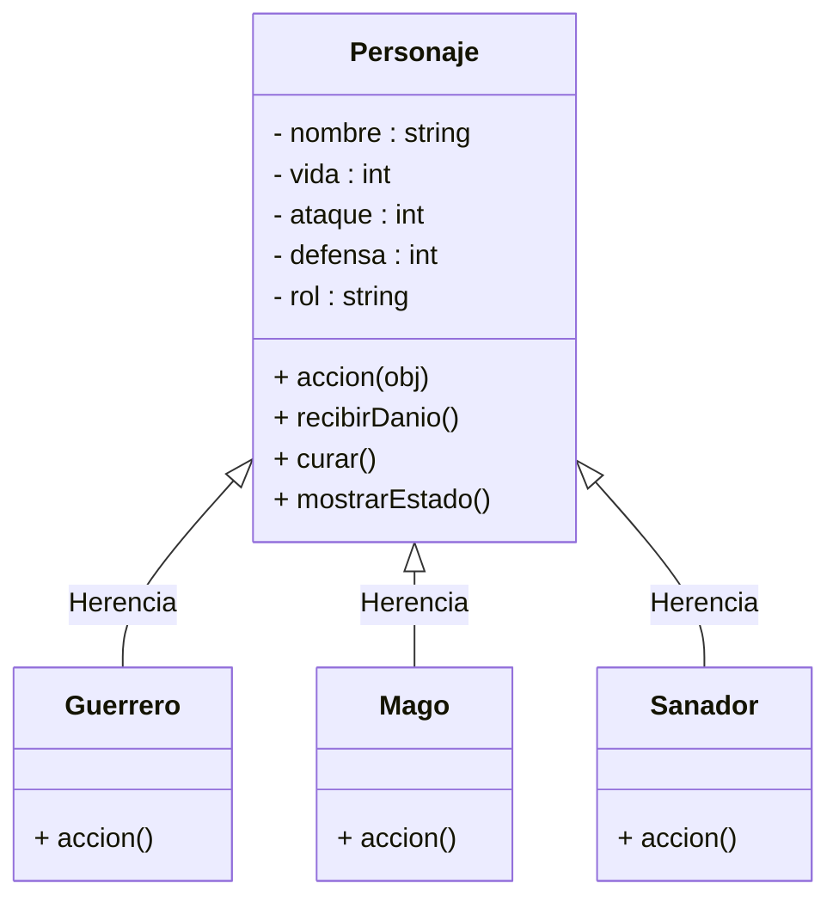

📌 Descripción del Proyecto

Este proyecto implementa un sistema de combate por turnos inspirado en un entorno de fantasía llamado Lyrenhold.
El jugador controla una Guild de héroes (Guerrero, Mago, Sanador) y se enfrenta a una Guild enemiga mediante un sistema de combate automático.

El juego incluye:

Manejo de personajes y roles

Atributos (vida, ataque, defensa)

Objetos mágicos consumibles

Inventario global

Asignación de objetos a los héroes

Sistema de turnos

Guardado y lectura del inventario en JSON

Todo desarrollado en C++ usando POO.

🎮 Características Principales
✔ 1. Personajes y Roles

El proyecto usa herencia para crear distintos tipos de personajes:

Guerrero

Ataques fuertes

Golpe crítico cada 3 turnos

Mago

Daño mágico aleatorio

Sanador

Cura a aliados

Además, los enemigos se crean usando la clase Oponente.

✔ 2. Objetos Mágicos

Cada objeto hereda de ObjetoMagico e implementa:

void aplicarEfecto(Personaje* objetivo);

Objetos incluidos:

Pocion de Vida

Amuleto de Furia

Escudo Bendito

Varita Helada

Pies Veloces

Pergamino de Fuego

Cada objeto modifica vida, ataque o defensa según su propósito.

✔ 3. Inventario Global

El inventario almacena cantidades de cada objeto:

unordered_map<string, int>

El jugador puede:

Ver inventario

Agregar o retirar objetos

Crear objetos dinámicamente

Asignarlos a un héroe

✔ 4. Guardado en JSON

La clase Inventario guarda su contenido en:

inventario.json

Ejemplo:

{
"Pocion": 2,
"Amuleto": 1,
"Escudo": 2,
"Varita": 1,
"Pies": 2,
"Pergamino": 1
}

Esto permite mantener el stock entre ejecuciones.

✔ 5. Combate Automático

La clase Arena controla:

Turnos

Ataques de héroes y enemigos

Comprobación de derrotas

Mensajes de batalla

Declaración del ganador

📂 Estructura del Proyecto
📁 ProyectoLyrenhold
│── main.cpp
│── Arena.h / Arena.cpp
│── Guild.h / Guild.cpp
│── Personaje.h / Personaje.cpp
│── Inventario.h / Inventario.cpp
│── ObjetoMagico.h
│── PocionVida.h / PocionVida.cpp
│── AmuletoFuria.h / AmuletoFuria.cpp
│── EscudoBendito.h / EscudoBendito.cpp
│── VaritaHelada.h / VaritaHelada.cpp
│── PiesVeloces.h / PiesVeloces.cpp
│── PergaminoFuego.h / PergaminoFuego.cpp
│── Guerrero.h / Guerrero.cpp
│── Mago.h / Mago.cpp
│── Sanador.h / Sanador.cpp
│── Oponente.h / Oponente.cpp
│── inventario.json  (archivo generado automáticamente)

▶️ Cómo Ejecutarlo

Compilar el proyecto completo

Ejecutar el programa

Navegar por el menú:

1. Ver héroes
2. Ver inventario
3. Asignar objeto
4. Iniciar combate
5. Salir

🧪 Demostración del Combate

Los héroes atacan primero

Luego atacan los enemigos

El combate continúa hasta que una guild queda sin personajes vivos

Los efectos de objetos se aplican automáticamente cuando se usan

🧾 Conceptos de POO Utilizados
🔹 Clases y Objetos

Cada personaje y objeto es una clase independiente.

🔹 Herencia

Mago, Guerrero y Sanador heredan de Personaje

Todos los objetos heredan de ObjetoMagico

🔹 Polimorfismo

El método:

virtual void accion(Personaje* objetivo) = 0;

Se ejecuta distinto según cada clase.

🔹 Encapsulamiento

Atributos privados: vida, ataque, defensa.

🔹 Composición

Los personajes tienen un inventario propio (vector).

